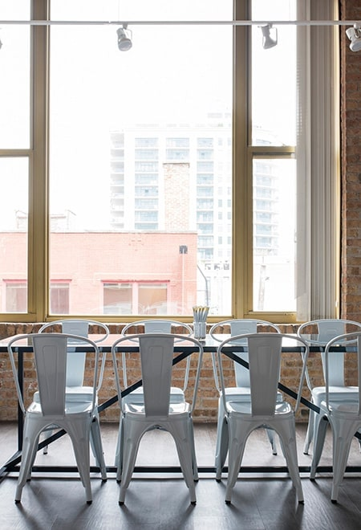

<!-- Section -->
<section class="md-section">
	

		

			

				
				<!-- title-01 -->
				

					<h6 class="title-01__subTitle">{{ page.title }}</h6>
					<h2 class="title-01__title">We Are The Leaders In This Industry</h2>
					
Curabitur elementum urna augue, eu porta purus gravida in. Cras consectetur, lorem a cursus vestibulum, ligula purus iaculis nulla, in dignissim risus turpis id justo. Sed eleifend ante et ligula eleifend ultricies. Fusce porta feugiat nisl, eget faucibus augue ultrices et. Nullam id leo fringilla, viverra est ut, faucibus lectus. Integer vel finibus ex, et convallis enim. Curabitur tristique convallis neque a eleifend. Donec mattis leo in velit scelerisque, sit amet ultricies erat mollis. Suspendisse potenti. Etiam commodo ipsum placerat, ornare libero a, consequat justo.

				
<!-- End / title-01 -->
				
			

		

	

</section>
<!-- End / Section -->

<!-- Section -->
<section class="md-section consult-background">
	

		

			

				
				<!-- title-01 -->
				

					<h6 class="title-01__subTitle">awardS</h6>
					<h2 class="title-01__title">This Is What We Get</h2>
				
<!-- End / title-01 -->
				
			

		

		

			

				
				<!-- iconbox -->
				

					
<i class="ti-cup"></i>

					

						<h2 class="iconbox__title"><a href="#">The Myth of Ugly Design</a></h2>
						
Duis porttitor libero ac egestas euismod. Maecenas quis felis turpis. Nulla quis turpis sed augue eg

					

				
<!-- End / iconbox -->
				
			

			

				
				<!-- iconbox -->
				

					
<i class="ti-crown"></i>

					

						<h2 class="iconbox__title"><a href="#">How to Create and Manage SVG Sprites</a></h2>
						
Sed ante nisl, fermentum et facilisis in, maximus sed ipsum. Cras hendrerit feugiat eros, ut fringil

					

				
<!-- End / iconbox -->
				
			

			

				
				<!-- iconbox -->
				

					
<i class="ti-world"></i>

					

						<h2 class="iconbox__title"><a href="#">Best National Locations</a></h2>
						
Etiam non varius justo, vel tempor mi. Nulla facilisi. Fusce at tortor arcu. Suspendisse maximus ac 

					

				
<!-- End / iconbox -->
				
			

			

				
				<!-- iconbox -->
				

					
<i class="ti-shine"></i>

					

						<h2 class="iconbox__title"><a href="#">How to Master Microcopy</a></h2>
						
Nam elit ligula, egestas et ornare non, viverra eu justo. Aliquam ornare lectus ut pharetra dictum. 

					

				
<!-- End / iconbox -->
				
			

		

	

</section>
<!-- End / Section -->

<!-- Our Advisors-->

<!-- Section -->
<section class="md-section" style="padding-bottom:0;">
	

		

			

				
				<!-- title-01 -->
				

					<h2 class="title-01__title">Our Advisors</h2>
				
<!-- End / title-01 -->
				
			

		

		

			
			<!-- carousel__element owl-carousel -->
			

				
				<!-- textbox -->
				

					

					

						<h2 class="textbox__title"><a href="#">Ashley Mills</a></h2>
						
Nam elit ligula, egestas et ornare non, viverra eu justo. Aliquam ornare lectus ut pharetra dictum. 

							
							<!-- social-01 -->
							

								<nav class="social-01__navSocial"><a class="social-01__item" href="#"><i class="fa fa-facebook"></i></a><a class="social-01__item" href="#"><i class="fa fa-skype"></i></a><a class="social-01__item" href="#"><i class="fa fa-twitter"></i></a><a class="social-01__item" href="#"><i class="fa fa-instagram"></i></a>
								</nav>
							
<!-- End / social-01 -->
							
					

				
<!-- End / textbox -->
				
				
				<!-- textbox -->
				

					

					

						<h2 class="textbox__title"><a href="#">Bruce Powell</a></h2>
						
Etiam non varius justo, vel tempor mi. Nulla facilisi. Fusce at tortor arcu. Suspendisse maximus ac 

							
							<!-- social-01 -->
							

								<nav class="social-01__navSocial"><a class="social-01__item" href="#"><i class="fa fa-facebook"></i></a><a class="social-01__item" href="#"><i class="fa fa-skype"></i></a><a class="social-01__item" href="#"><i class="fa fa-twitter"></i></a><a class="social-01__item" href="#"><i class="fa fa-instagram"></i></a>
								</nav>
							
<!-- End / social-01 -->
							
					

				
<!-- End / textbox -->
				
				
				<!-- textbox -->
				

					

					

						<h2 class="textbox__title"><a href="#">Ann Fowler</a></h2>
						
Sed ante nisl, fermentum et facilisis in, maximus sed ipsum. Cras hendrerit feugiat eros, ut fringil

							
							<!-- social-01 -->
							

								<nav class="social-01__navSocial"><a class="social-01__item" href="#"><i class="fa fa-facebook"></i></a><a class="social-01__item" href="#"><i class="fa fa-skype"></i></a><a class="social-01__item" href="#"><i class="fa fa-twitter"></i></a><a class="social-01__item" href="#"><i class="fa fa-instagram"></i></a>
								</nav>
							
<!-- End / social-01 -->
							
					

				
<!-- End / textbox -->
				
				
				<!-- textbox -->
				

					

					

						<h2 class="textbox__title"><a href="#">Cynthia Aguilar</a></h2>
						
Integer placerat ullamcorper urna nec rhoncus. Sed velit justo, lacinia non sapien imperdiet, sagitt

							
							<!-- social-01 -->
							

								<nav class="social-01__navSocial"><a class="social-01__item" href="#"><i class="fa fa-facebook"></i></a><a class="social-01__item" href="#"><i class="fa fa-skype"></i></a><a class="social-01__item" href="#"><i class="fa fa-twitter"></i></a><a class="social-01__item" href="#"><i class="fa fa-instagram"></i></a>
								</nav>
							
<!-- End / social-01 -->
							
					

				
<!-- End / textbox -->
				
			
<!-- End / carousel__element owl-carousel -->
			
		

	

</section>
<!-- End / Section -->

<!-- Latest Projects-->

<!-- Section -->
<section class="md-section" style="padding-bottom:0;">
	

		

			

				
				<!-- title-01 -->
				

					<h2 class="title-01__title">Latest Projects</h2>
				
<!-- End / title-01 -->
				
			

		

	

	

		

			

				
				<!-- post-02 -->
				

					

					

						<h2 class="post-02__title"><a href="#">How to Create and Manage SVG Sprites</a></h2>
						
Business Consulting

						

							
Etiam non varius justo, vel tempor mi. Nulla facilisi. Fusce at tortor arcu. Suspendisse maximus ac nisl eu porta. Praesent eget consequat nisi, at mollis turpis. Quisque sed venenatis neque, at molli
<a class="post-02__link" href="#">View detail</a>
						

					

				
<!-- End / post-02 -->
				
			

			

				
				<!-- post-02 -->
				

					

					

						<h2 class="post-02__title"><a href="#">Is UX Really That Important?</a></h2>
						
Business Consulting

						

							
Nam elit ligula, egestas et ornare non, viverra eu justo. Aliquam ornare lectus ut pharetra dictum. Aliquam erat volutpat. In fringilla erat at eros pharetra faucibus. Nunc a magna eu lectus fringilla
<a class="post-02__link" href="#">View detail</a>
						

					

				
<!-- End / post-02 -->
				
			

			

				
				<!-- post-02 -->
				

					

					

						<h2 class="post-02__title"><a href="#">How to Create and Manage SVG Sprites</a></h2>
						
Business Consulting

						

							
Suspendisse ac elit vitae est lacinia interdum eu sit amet mauris. Phasellus aliquam nisi sit amet libero mattis ornare. In varius nunc vel suscipit rhoncus. Nunc hendrerit nisl nec orci eleifend accu
<a class="post-02__link" href="#">View detail</a>
						

					

				
<!-- End / post-02 -->
				
			

			

				
				<!-- post-02 -->
				

					

					

						<h2 class="post-02__title"><a href="#">5 Ways to Use 404 Pages</a></h2>
						
Business Consulting

						

							
Sed ante nisl, fermentum et facilisis in, maximus sed ipsum. Cras hendrerit feugiat eros, ut fringilla nunc finibus sed. Quisque vitae dictum augue, vitae pretium sem. Proin tristique lobortis mauris 
<a class="post-02__link" href="#">View detail</a>
						

					

				
<!-- End / post-02 -->
				
			

		

	

</section>
<!-- End / Section -->

<!-- What’s Client Say ?-->

<!-- Section -->
<section class="md-section" style="padding-bottom:0;">
	

		

			

				
				<!-- title-01 -->
				

					<h2 class="title-01__title">What’s Client Say?</h2>
				
<!-- End / title-01 -->
				
			

		

		

			
			<!-- carousel__element owl-carousel -->
			

				
				<!-- testimonial -->
				

					

						<h5 class="testimonial__name">Kenny White</h5>Management at Evanto Inc,
					

					

						
Mauris lacinia venenatis dolor sit amet viverra. Integer malesuada nulla neque. Sed rutrum ligula eu sagittis volutpat. Aliquam erat volutpat. Praesen

					

				
<!-- End / testimonial -->
				
				
				<!-- testimonial -->
				

					

						<h5 class="testimonial__name">Helen Lane</h5>CEO at Google Inc,
					

					

						
Lorem ipsum dolor sit amet, consectetur adipiscing elit. Ut laoreet ut lacus a tincidunt. Quisque luctus nibh augue, non ultrices arcu molestie in. In

					

				
<!-- End / testimonial -->
				
				
				<!-- testimonial -->
				

					

						<h5 class="testimonial__name">Cynthia Aguilar</h5>Management at Evanto Inc,
					

					

						
Lorem ipsum dolor sit amet, consectetur adipiscing elit. Ut laoreet ut lacus a tincidunt. Quisque luctus nibh augue, non ultrices arcu molestie in. In

					

				
<!-- End / testimonial -->
				
			
<!-- End / carousel__element owl-carousel -->
			
		

	

</section>
<!-- End / Section -->

<!-- Our partner-->

<!-- Section -->
<section class="md-section">
	

		

			

				
				<!-- title-01 -->
				

					<h2 class="title-01__title">Our Partner</h2>
				
<!-- End / title-01 -->
				
			

		

		
		<!-- carousel__element owl-carousel -->
		

			
			<!--  -->
			

				

			
<!-- End /  -->
			
			
			<!--  -->
			

				

			
<!-- End /  -->
			
			
			<!--  -->
			

				

			
<!-- End /  -->
			
			
			<!--  -->
			

				

			
<!-- End /  -->
			
			
			<!--  -->
			

				

			
<!-- End /  -->
			
		
<!-- End / carousel__element owl-carousel -->
		
	

</section>
<!-- End / Section -->